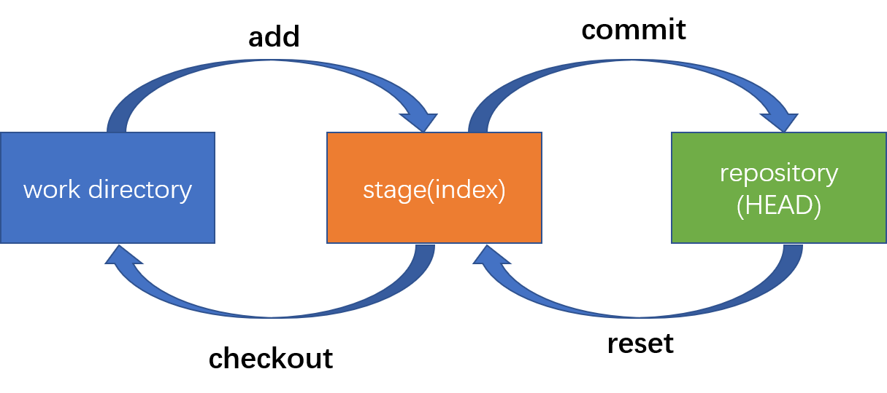

## 配置git
下载git后，先配置git的用户信息
```
git config --global user.name "your name"
git config --global user.email "your email"
```
## 版本回退
首先先了解git的基本工作流程<br>

### reset
```
git reset --[mixed][soft][hard] HEAD~
```
reset命令有三个选项：
* mixed		默认选项，git会先将仓库的HEAD指针指向前一个快照，同时将该快照回滚到暂存区
* soft		git将HEAD指针指向前一个快照，但是并不会将快照回滚到暂存区
* hard 		git将HEAD指针指向前一个快照，同时将该快照回滚到暂存区，然后再将回滚后的暂存区内容还原到工作区
<br><br>
想要回滚到哪一个快照，可以用HEAD\~的方式，想回滚几个就加几个\~，或者只加一个\~，但是在~后面跟上想回滚的次数；也可以使用git log命令查看各个版本快照的ID号，通过ID号精准回滚